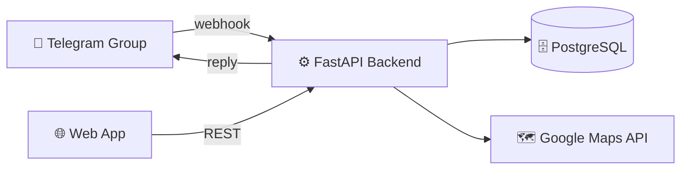

# PICK (Food) — Project Planning

> **Problem:** เข้าออฟฟิศแล้วกลางวันไม่รู้จะกินอะไรดี
> **Type:** POC / Mini-project
> **Task ID:** TASK-1530

---

## Root Cause Analysis

| Pain Point | ปัญหาที่แท้จริง |
|---|---|
| Decision Fatigue | สมองล้าจากการตัดสินใจทั้งวัน ไม่อยากคิดตอนเที่ยง |
| Group Coordination | คนในทีมความชอบต่างกัน หาจุดร่วมยาก |
| Monotony | ไม่มีระบบจำ วนกินร้านเดิมซ้ำๆ |
| Time Pressure | พักเที่ยงสั้น ไม่มีเวลา debate |
| Social Dynamics | กลัวเสียหน้าถ้าเลือกร้านแล้วคนอื่นไม่ชอบ |

---

## System Architecture



### Data Flow หลัก (`/lunch`)

1. User พิมพ์ `/lunch` ใน TG Group
2. Telegram → Webhook → FastAPI
3. FastAPI เช็ค attendance (≥ 2 คนไหม?)
4. ดึงร้านจาก Maps API + manual DB
5. Run filter pipeline (open / blacklist / history / closing)
6. ส่ง 3 ตัวเลือก + inline keyboard กลับ TG
7. User โหวต → callback → บันทึก vote → timeout → ประกาศ winner

---

## Tech Stack

| Layer | Technology |
|---|---|
| Frontend | Next.js + Tailwind CSS |
| Backend | FastAPI (Python) |
| Database | PostgreSQL via Railway |
| AI / Maps | Google Maps Places API + Claude/GPT |
| Notification | Telegram Bot API |
| Deploy | Vercel (frontend) + Railway (backend + database) |

---

## POC Strategy

> **Telegram Bot = Primary (full features)**
> **Web App = Minimal (blacklist + history เท่านั้น)**

ทำ Telegram Bot ให้ครบก่อน → demo กับทีมได้เร็ว → ค่อยทำ Web เพิ่ม

---

## Features

### Telegram Bot — Full Features (POC หลัก)

| Feature | Pain Point ที่แก้ |
|---|---|
| `/lunch` → เสนอ 3 ร้าน | Decision Fatigue |
| `/gacha` → สุ่มทันที | Decision Fatigue + Time Pressure |
| Group Poll + Timeout (inline keyboard) | Group Coordination |
| Anti-Repeat (History Tracker) | Monotony |
| Personal Blacklist (ใช้ผ่าน bot command) | Group Dynamics |
| Filter: ร้านที่เปิดอยู่ | Time Pressure |
| แสดง distance + ราคา + ประเภทอาหาร | Decision Quality |
| `/addrestaurant` → เพิ่มร้านที่ไม่มีใน Google Maps | Completeness |

### Web App — Minimal (ทำพอใช้ได้)

| Feature | หมายเหตุ |
|---|---|
| จัดการ Blacklist | เพิ่ม/ลบร้าน (ค้นหาร้านจาก Maps API) |
| ดู Lunch History | List เรียบๆ ไม่ต้องมี analytics |
| Pairing ผ่าน `/start` | รับ link จาก Bot → ไม่ต้อง auth system |

### Tier 2 — Post-POC (หลัง demo ทีม)

- **Custom Location Search** — `/lunch near <ชื่อสถานที่>` หรือ share location ผ่าน Telegram
  - ใช้ Google Geocoding API แปลงชื่อสถานที่ → lat/lng
  - ค้นหาร้านรอบพิกัดนั้นแทนออฟฟิศ
  - ใช้กรณีต้องไปทำธุระต่อหลังกินข้าว เช่น รอบสถานีรถไฟ

### Tier 3 — Future (ต้องการ data สะสมก่อน)

- **Favorites + Frequent Hybrid** (Option C)
  - **Favorites** (manual) — user กด ❤️ mark ร้านโปรด → boost weight ใน recommendation + `/favorite` shortcut เรียกตรง
  - **Frequent** (auto-detect) — ระบบนับจาก history: กินเกิน X ครั้ง/สัปดาห์ → penalty (ลดน้ำหนัก) เพื่อกระจายให้ลองร้านใหม่
  - แยก logic: "โปรด = อยากให้เสนอ" vs "ประจำ = กินบ่อยพอแล้ว"
  - **POC ใช้ Option D** — ไม่มี favorites ระบบ ใช้แค่ history cooldown + manual add ก็พอ (เรียบง่าย ลดความซับซ้อน)
- Mood-based recommendation
- Post-meal rating
- Budget cap ต่อคน
- Dietary restriction filter (vegetarian, halal, เจ)
- Analytics / history visualization

---

## Restaurant Data Model

ระบบรองรับ **Hybrid Model** — ร้านจาก Google Maps และร้านที่ add เอง

| Field | Google Maps | Manual |
|---|---|---|
| ชื่อร้าน | ✅ | ✅ |
| พิกัด / Distance filter | ✅ | ❌ |
| เปิด/ปิด auto-check | ✅ | ❌ |
| ราคา (price_level) | ✅ | กรอกเอง |
| โหวตใน Poll | ✅ | ✅ |
| ประวัติการกิน | ✅ | ✅ |

ร้าน manual จะถูกแสดงใน poll ได้ตามปกติ เพียงแต่ไม่มี distance filter และ open_now check

---

## Google Maps API — Data & Caching Strategy

### 📦 ข้อมูลที่ได้จาก Nearby Search (ต่อ 1 ร้าน)

| Field | คำอธิบาย |
|---|---|
| `place_id` | ID ถาวรของ Google (unique key) |
| `name` | ชื่อร้าน |
| `geometry.location` | lat/lng (พิกัด) |
| `vicinity` | ที่อยู่ย่อ |
| `rating` | ดาว 1-5 |
| `user_ratings_total` | จำนวนรีวิว |
| `price_level` | ระดับราคา 0-4 (฿ ถึง ฿฿฿฿) |
| `types` | ["restaurant", "cafe", "thai_restaurant"] |
| `business_status` | OPERATIONAL / CLOSED |
| `opening_hours.open_now` | เปิดอยู่ไหม (boolean) |
| `photos[]` | reference รูป (ใช้โหลดรูปจริงผ่าน Photo API) |

### 💾 Caching 2 ชั้น

**ชั้น 1 — DB ถาวร (`restaurants` table)**
- เก็บทุกร้านที่เคย fetch เจอ + metadata
- ใช้ `place_id` เป็น unique key → **UPSERT by place_id** เจอร้านเดิมไม่ซ้ำ แค่ update
- Field `last_fetched_at` → รู้ว่าข้อมูลเก่าแค่ไหน
- ข้อมูลร้านสะสมเรื่อย ๆ ใช้ต่อยอด history, blacklist, analytics ได้

**ชั้น 2 — Session memory (pool สำหรับ poll session)**
- หลัง filter แล้ว (open_now, blacklist, history, distance) → เหลือ ~10 ร้าน
- เก็บใน memory ของ poll session นั้น
- Gacha สุ่มจาก pool นี้ (**ไม่ call API ใหม่**)
- จบ poll → ทิ้ง

### 🔄 Strategy: เมื่อไหร่ควร call API ใหม่?

**POC (เรียบง่าย):**
- ทุก `/lunch` → call Nearby Search 1 ครั้ง → ได้ fresh data
- เหตุผล: `open_now` ต้อง realtime + simpler code

**Future optimization (save cost):**
- Cache 24 ชม. → ถ้ามีคน `/lunch` ซ้ำในวันเดียว ใช้ของเก่า
- Re-check `open_now` จาก `opening_hours` ที่เก็บไว้ (parse weekday_text)
- ลด API calls ~80% ถ้าทีมใช้ bot หลายรอบ/วัน

### 💰 Cost Implication

- Nearby Search: $0.032/request
- $200 free credit/เดือน → ~6,250 requests ฟรี
- ทีม 6 คน × 1 ครั้ง/วัน × 22 วัน = **132 requests/เดือน** → ฟรีสบาย ๆ
- **Gacha ไม่เสีย cost** — แค่ reshuffle pool ที่ cache ไว้

---

## Database Schema

### `users`
```sql
id            UUID PRIMARY KEY
telegram_id   TEXT UNIQUE
name          TEXT
location_lat  FLOAT
location_lng  FLOAT
created_at    TIMESTAMP
```

### `restaurants`
```sql
id              UUID PRIMARY KEY
source          TEXT   -- 'google_maps' | 'manual'
google_place_id TEXT   -- NULL ถ้าเป็น manual
name            TEXT   NOT NULL
lat             FLOAT  -- NULL ถ้าไม่รู้พิกัด
lng             FLOAT  -- NULL ถ้าไม่รู้พิกัด
avg_price              INT    -- ราคาเฉลี่ย (บาท) — กรอกเองถ้า manual
price_level            INT    -- 1-4 จาก Google Maps (อาจ NULL)
category               TEXT   -- ประเภทอาหาร
closed_weekdays        INT[]  -- [0=จันทร์ ... 6=อาทิตย์] วันในสัปดาห์ที่ปิด
closed_monthly_ranges  JSONB  -- [{"start":1,"end":3},{"start":15,"end":17}]
closing_note           TEXT   -- หมายเหตุวันหยุดที่ระบุ range ไม่ได้
added_by               TEXT   -- telegram_id ของคนที่เพิ่ม
group_id               TEXT   -- Telegram chat_id (ถ้าเป็นของกลุ่ม)
created_at             TIMESTAMP
```

### `user_blacklist`
```sql
id              UUID PRIMARY KEY
user_id         UUID REFERENCES users(id)
restaurant_id   UUID REFERENCES restaurants(id)
note            TEXT
created_at      TIMESTAMP
```

### `lunch_history`
```sql
id              UUID PRIMARY KEY
user_id         UUID REFERENCES users(id)
restaurant_id   UUID REFERENCES restaurants(id)
restaurant_name TEXT   -- snapshot ชื่อ ณ เวลานั้น
eaten_at        DATE
created_at      TIMESTAMP
```

### `user_attendance`
```sql
id          UUID PRIMARY KEY
user_id     UUID REFERENCES users(id)
group_id    TEXT      -- Telegram chat_id
date        DATE      -- วันที่ (เช่น 2026-04-17)
status      TEXT      -- 'in_office' | 'wfh' | 'unknown'
updated_at  TIMESTAMP
```

### `poll_session`
```sql
id          UUID PRIMARY KEY
group_id    TEXT   -- Telegram chat_id
options     JSONB  -- [{restaurant_id, name, distance_km, avg_price, source}]
expires_at  TIMESTAMP
status      TEXT   -- 'active' | 'completed' | 'timeout'
winner_id   UUID   -- restaurant_id ที่ชนะ
created_at  TIMESTAMP
```

### `poll_votes`
```sql
id              UUID PRIMARY KEY
session_id      UUID REFERENCES poll_session(id)
user_id         UUID REFERENCES users(id)
restaurant_id   UUID REFERENCES restaurants(id)
vote            BOOLEAN  -- true = yes, false = no
created_at      TIMESTAMP
```

---

## API Endpoints

### Restaurants
```
GET    /restaurants           # ดูรายชื่อร้านทั้งหมดของกลุ่ม (Maps + manual)
POST   /restaurants           # เพิ่มร้าน manual
PATCH  /restaurants/{id}      # แก้ไขร้าน manual (เฉพาะ source='manual', โดยผู้เพิ่มเท่านั้น)
DELETE /restaurants/{id}      # ลบร้าน manual (เฉพาะ admin/ผู้เพิ่ม)
```

### Recommendation
```
POST /recommend          # ขอ 3 ตัวเลือก (ผ่าน filter ทั้งหมด)
POST /gacha              # สุ่ม 1 ร้านทันที
```

### History
```
GET  /history            # ดูประวัติการกิน
POST /history            # บันทึกร้านที่กิน
```

### Blacklist
```
GET    /blacklist        # ดู blacklist ของตัวเอง
POST   /blacklist        # เพิ่มร้านเข้า blacklist
DELETE /blacklist/{id}   # ลบออกจาก blacklist
```

### Attendance
```
POST /attendance         # บันทึกหรืออัปเดต status (wfh / in_office)
GET  /attendance/today   # ดู status ของวันนี้ทุกคนในกลุ่ม
```

### Poll
```
POST /poll               # สร้าง poll จาก options (ตรวจ threshold ก่อน)
POST /poll/{id}/vote     # โหวต
GET  /poll/{id}/result   # ดูผล
```

### Telegram
```
POST /telegram/webhook   # รับ event จาก Telegram Bot
```

---

## Technical Task Breakdown

### Phase 1 — Foundation

- [ ] Setup Railway PostgreSQL + สร้าง schema ทั้งหมด (รวม `restaurants` table)
- [ ] Setup FastAPI project structure
- [ ] Integrate Google Maps Places API (Nearby Search)
- [ ] Implement `open_now` filter (ใช้ parameter จาก Maps API)
- [ ] Map `price_level` → ฿/฿฿/฿฿฿
- [ ] คำนวณ distance (Haversine หรือ Maps Distance Matrix API)
- [ ] Implement manual restaurant CRUD (POST/GET/PATCH/DELETE /restaurants)
  - PATCH อนุญาตเฉพาะ `source='manual'` และเฉพาะ `added_by` เจ้าของเท่านั้น
  - Fields ที่แก้ได้: `name`, `avg_price`, `category`, `lat`, `lng`, `closed_weekdays`, `closed_monthly_ranges`, `closing_note`

### Phase 2 — Core Logic

- [ ] Implement History Tracker (POST + GET /history)
- [ ] Implement Personal Blacklist (CRUD /blacklist)
- [ ] Build Recommendation Pipeline:
  - ดึงร้านจาก Maps API + รวม manual restaurants ของกลุ่ม
  - Filter: open_now (Maps restaurants เท่านั้น)
  - Filter: `closed_weekdays` — ตรวจวันในสัปดาห์
  - Filter: `closed_monthly_ranges` — ตรวจว่าวันที่วันนี้อยู่ใน range ที่ปิดไหม
  - Filter: blacklist ของทุกคนในกลุ่มที่ status = in_office วันนี้
  - Filter: ประวัติซ้ำ 5 วัน
  - Return top 3
- [ ] Implement Gacha (random จาก eligible pool + auto-save history)

### Phase 3 — Telegram Bot (demo ได้แล้วหลัง phase นี้!)

- [ ] Setup Telegram Bot (webhook)
- [ ] `/start` — register user + generate web pairing link
- [ ] `/wfh` — ประกาศว่าวันนี้ไม่เข้าออฟฟิศ (skip poll)
- [ ] `/in` — ยืนยันว่าเข้าออฟฟิศ (กลับเข้า pool)
- [ ] `/lunch` — trigger recommendation → นับ attendance ก่อน → เปิด poll ตาม threshold
- [ ] `/gacha` — สุ่ม 1 ร้านทันที + บันทึก history
- [ ] `/blacklist add <ชื่อร้าน>` — เพิ่ม blacklist ผ่าน bot
- [ ] `/blacklist list` — ดู blacklist ของตัวเอง
- [ ] `/addrestaurant <ชื่อร้าน> [ราคาเฉลี่ย] [ประเภท]` — เพิ่มร้าน manual ที่ไม่มีใน Maps
- [ ] `/editrestaurant <ชื่อร้าน>` — แก้ไขร้าน manual ที่ตัวเองเพิ่มไว้ (bot จะถามทีละ field)
  - รวมถึงตั้ง `closed_weekdays` และ `closed_monthly_ranges` ด้วย
- [ ] Implement Attendance tracking (CRUD /attendance)
  - `/wfh` → set status = 'wfh'
  - `/in` → set status = 'in_office'
  - unknown = ไม่ได้กดอะไร (drop ออกหลัง poll timeout)
- [ ] Implement Poll threshold logic ก่อนสร้าง poll:
  - 0 คน in_office/unknown → ไม่ส่ง poll
  - 1 คน → บอตแจ้ง "มาคนเดียว เลือกเองเลยนะ" พร้อม suggest ร้าน
  - ≥ 2 คน → เปิด poll ตามปกติ
- [ ] Implement Poll Session (create + vote + timeout)
- [ ] Background task: auto-pick winner เมื่อ timeout
- [ ] Handle vote callback จาก Telegram inline keyboard

### Phase 4 — Web App (Minimal)

- [ ] Setup Next.js project
- [ ] Pairing flow: `/start` token → link account
- [ ] หน้าจัดการ Blacklist (ค้นหาร้านจาก Maps + เพิ่ม/ลบ)
- [ ] หน้าดู Lunch History (list เรียบๆ)
- [ ] ไม่ต้องทำ auth system — ใช้ token จาก Telegram

### Phase 5 — Deploy & Polish

- [ ] Deploy backend → Railway
- [ ] Deploy frontend → Vercel
- [ ] Setup environment variables
- [ ] End-to-end testing ทุก flow
- [ ] ทดสอบกับทีมจริง

---

## Implementation Order (Dependency Graph)

```
Google Maps API + Filters (open/price/distance)
        ↓
History Tracker + Blacklist
        ↓
Recommendation Engine (รวม filters ทั้งหมด)
        ↓
Gacha Mode
        ↓
Telegram Bot (notification + /lunch command)
        ↓
Group Poll + Timeout
        ↓
Frontend UI
```

---

## Key Decisions

| Decision | เหตุผล |
|---|---|
| Hybrid restaurant model | รองรับร้านที่ไม่มีใน Google Maps (รถเข็น, โรงอาหาร, ร้านในซอย) — add manual ได้ผ่าน bot |
| ไม่เก็บ restaurant data เอง (Maps) | ดึง realtime จาก Google Maps ลด maintenance สำหรับร้านทั่วไป |
| Timeout auto-pick | ป้องกันกรณีไม่มีใครโหวต — ยังได้ร้านเสมอ |
| Tier 3 ไม่อยู่ใน MVP | ต้องการ data สะสมก่อนถึงจะ useful |
| Telegram เป็น primary UX | ทีมใช้ Telegram อยู่แล้ว — ลด friction การ onboard |
| Web App เป็น minimal | validate กับทีมก่อน ค่อย invest ใน Web UX เพิ่มทีหลัง |
| ไม่ทำ auth system ใน web | ใช้ token pairing จาก `/start` แทน — ลด scope POC |
| Gacha limit 5 ครั้ง/มื้อ | ไม่ได้เพื่อ save cost (Gacha ไม่ call API) — เพื่อกัน decision fatigue + บังคับ commit; ยืดหยุ่นกว่า 3 ครั้งแต่ยังกันวน infinite; ปรับได้ทีหลัง |
| POC Scope = Full POC | Must + Should + Could ทั้งหมด รวม Gacha, Manual restaurants, History web page, Blacklist today-only — ได้ผลลัพธ์ครบ demo เต็ม ใช้เวลา ~10 วัน |
| Maps API: fetch ทุก `/lunch` (POC) | เน้น simplicity + fresh data (`open_now` realtime); 132 req/เดือน < $200 credit ฟรี; cache strategy เก็บไว้ใน `next-feature.md` ค่อยทำถ้าทีมบ่นเรื่อง cost หรือร้านซ้ำ |
| Attendance threshold = 2 คน | ทีม 6 คน / poll 2 คนยังมีความหมาย — 1 คนไม่ต้องโหวต แค่แจ้งร้านแนะนำ |
| Self-declare + timeout hybrid | `/wfh` สำหรับคนที่รู้ตัวล่วงหน้า, unknown drop อัตโนมัติหลัง poll timeout |

---

*Last updated: 2026-04-17 (added attendance tracking + poll threshold)*
*Researched by: Researcher Agent*
